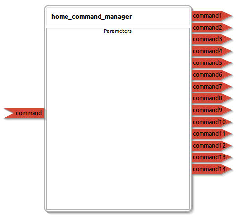

home_command_manager
====================

General description
---------------------
The home_command_manager package

Node: home_command_manager
---------------------
#### Parameters

#### Published Topics
**command1** *(std_msgs::Empty)*   
<!--- protected region command1 on begin -->
<!--- protected region command1 end -->

**command2** *(std_msgs::Empty)*   
<!--- protected region command2 on begin -->
<!--- protected region command2 end -->

**command3** *(std_msgs::Empty)*   
<!--- protected region command3 on begin -->
<!--- protected region command3 end -->

**command4** *(std_msgs::Empty)*   
<!--- protected region command4 on begin -->
<!--- protected region command4 end -->

**command5** *(std_msgs::Empty)*   
<!--- protected region command5 on begin -->
<!--- protected region command5 end -->

**command6** *(std_msgs::Empty)*   
<!--- protected region command6 on begin -->
<!--- protected region command6 end -->

**command7** *(std_msgs::Empty)*   
<!--- protected region command7 on begin -->
<!--- protected region command7 end -->

**command8** *(std_msgs::Empty)*   
<!--- protected region command8 on begin -->
<!--- protected region command8 end -->

**command9** *(std_msgs::Empty)*   
<!--- protected region command9 on begin -->
<!--- protected region command9 end -->

**command10** *(std_msgs::Empty)*   
<!--- protected region command10 on begin -->
<!--- protected region command10 end -->

**command11** *(std_msgs::Empty)*   
<!--- protected region command11 on begin -->
<!--- protected region command11 end -->

**command12** *(std_msgs::Empty)*   
<!--- protected region command12 on begin -->
<!--- protected region command12 end -->

**command13** *(std_msgs::Empty)*   
<!--- protected region command13 on begin -->
<!--- protected region command13 end -->

**command14** *(std_msgs::Empty)*   
<!--- protected region command14 on begin -->
<!--- protected region command14 end -->

#### Subscribed Topics
**command** *(std_msgs::Int32)*   
<!--- protected region command on begin -->
<!--- protected region command end -->

